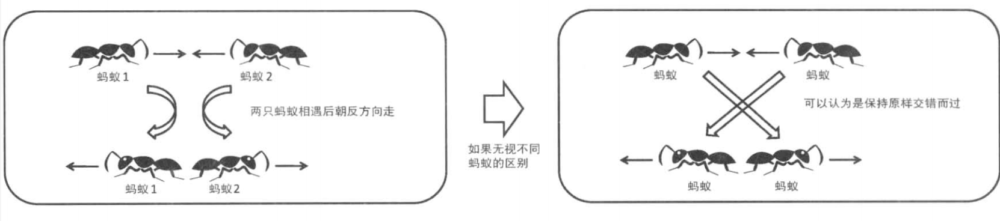

# VOJ上一定要做题才有用！！！刷题！！！


## 1.2 最负盛名的程序设计竞赛

### 1.2.1 世界规模的大赛—— Google Code Jam (GCJ)

### 1.2.2 向高排名看齐！—— TopCoder

### 1.2.3 历史最悠久的竞赛 ACM-ICPC

ACM-ICPC是由美国计算机协会（ACM)主办的、面向大学生的竞赛，也是历史最悠久的程序设计竞赛。这是一个三人一队的团队比赛，选手要在5个小时内解决大约10道题。因为比赛中三名选手共用一台电脑，题量又比其他赛事多，并且多是一些实现复杂的问题，所以团队配合显得异常重要。想要从日本参加该项赛事，首先要参加在线进行的国内预选赛’胜出后才能参加亚洲区域赛，取得前几名的好成绩后才能够参加世界总决赛。

### 1.2.4 面向中学生的信息学奥林匹克竞赛棗 JOI-IOI

### 1.2.5 通过网络自动评测 Online Judge (OJ)


## 1.5 以高效的算法为目标

## 1.6 轻松热身

Ants (POJ No.1852)
n只蚂蚁以每秒 lcm的速度在长为 Lcm的竿子上爬行。当蚂蚁爬到竿子的端点时就会掉落。由于竿子太细，两只蚂蚁相遇时，它们不能交错通过，只能各自反向爬回去。对于每只蚂蚁，我们知道它距离竿子左端的距离 X,，但不知道它当前的朝向。请计算**所有蚂蚁**落下竿子所需的最短时间和最长时间。


首先对于最短时间，看起来所有蚂蚁都朝向较近的端点走会比较好。事实上，这种情况下不会发生两只蚂蚁相遇的情况，而且也不可能在比此更短的时间内走到竿子的端点。


为了思考最长时间的情况，让我们看看蚂蚁相遇时会发生什么



可以认为每只蚂蚁都是独立运动的，所以要求最长时间，只要求蚂蚁到竿子端点的最大距离就好了。

```c
int L,n;
int x[MAX_N];

void solve(){
    //最短时间
    int minT =0;
    for(int i=0;i<n;i++){
        minT=max(minT,min(x[i],L-x[i]));
    }
    //最长时间
    int maxT=0;
    for(int i=0;i<n;i++){
        maxT=max(maxT,max(x[i],L-x[i]));
    }
    printf("%d %d\n",minT,maxT);
}
```


抽 签
你的朋友提议玩一个游戏：将写有数字的n个纸片放入口袋中，你可以从口袋中抽取 4 次纸片 ，每次记下纸片上的数字后都将其放回口袋中。如果这 4 个数字的和是 m, 就是你赢，否则就是你的朋友赢。你挑战了好几回，结果一次也没赢过，于是怒而撕破口袋，取出所有纸片 ，检查自己是否真的有赢的可能性。请你编写一个程序，判断当纸片上所写的数字是 k1,k2,ki,…，kn时，是否存在抽取 4 次和为 wm的方案。如果存在，输出 Yes; 否则，输出 No


要求复杂度比较低的情况下

```c
int n,m,k;

int kk[MAX_N*MAX_N];

bool binary_search(int x){
    int l=0,r=n*n;
    
    while(r-l>1){
        int i=(l+r)/2;
        if(kk[i]==x) return true; //找到x
        else if(kk[i]<x) l=i+1;
        else r=i;
    }
    return false; //没找到
}

void solve(){
    //枚举k[c]+k[d]的和
    for(int c=0;c<n;c++){
        for(int d=0;d<n;d++){
            k[c*n+d]=k[c]+k[d];
        }
    }
    //排序以进行二分搜索
    sort(kk,kk+n*n);
    bool f=false;
    for(int a=0;a<n;a++){
        for(int b=0;b<n;b++){
            //二分搜索
            if(binary_search(m-k[a]-k[b]))	//检查是否有c和d使得 kc + kd = m-ka -kb。
                f=true;
        }
     
    }
    if(f) puts("Yes");
    else puts("No");
    
    
}
```

