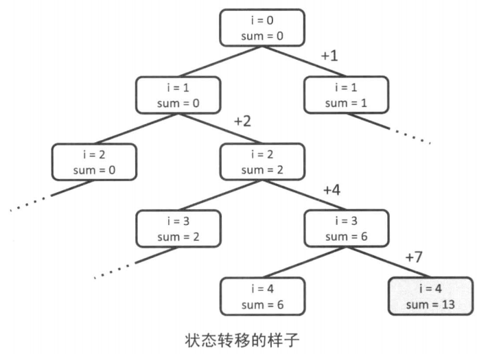
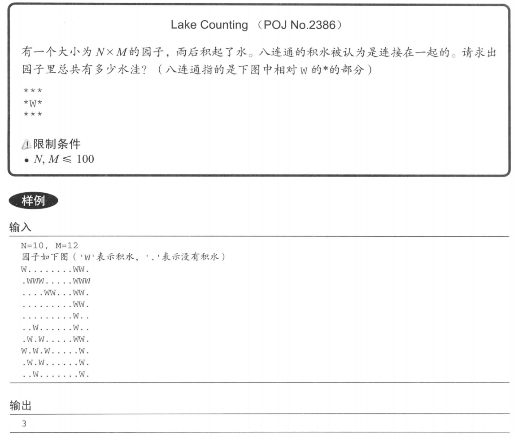
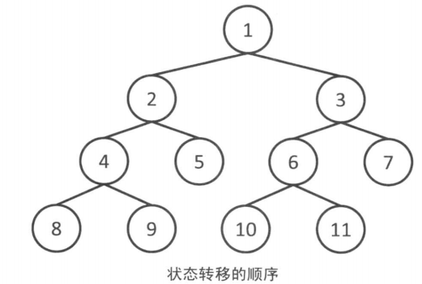
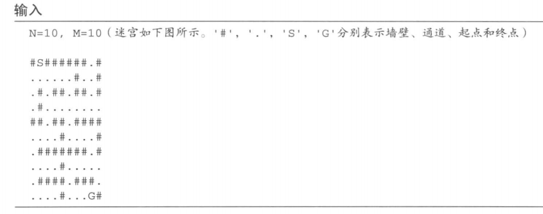
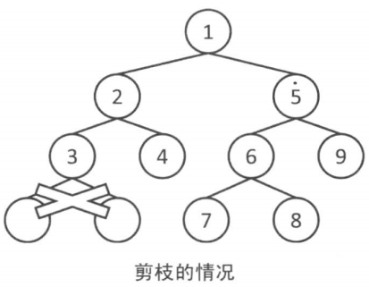

穷竭搜索是将所有的可能性罗列出来，在其中寻找答案。主要介绍**深度优先搜索**和**广度优先搜索**这两种方法。

### 2.1.1 递归函数

在一个函数中再次调用该函数自身的行为叫做递归

在编写一个递归函数时，函数的停止条件是必须存在的

### 2.1.2 栈

栈（ Stack)是支持push和pop两种操作的数据结构。push是在栈的顶端放人一组数据的操作。反之，pop是从其顶端取出一组数据的操作。因此，最后进入栈的一组数据可以最先被取出（这种行为被叫做LIFO:Last In First Out, 即后进先出 ）。

c++中STL

stack::pop完成的仅仅是移除最顶端的数据。如果要访问最顶端的数据，需要使用stack::top函数（这个操作通常也被称为peek)

### 2.1.3 队列

队列（Queue)与栈一样支持push和pop两个操作。但与栈不同的是，pop完成的不是取出最顶端的元素，而是取出最底端的元素。也就是说最初放人的元素能够最先被取出(这种行为被叫做FIFO:First In First Out, 即先进先出）。

在C++中queue::front是用来访问最底端数据的函数

### 2.1.4 深度优先搜索

深度优先搜索（DFS, Depth-First Search) 是搜索的手段之一。它从某个状态开始，不断地转移状态直到无法转移，然后回退到前一步的状态，继续转移到其他状态，如此不断重复，直至找到最终的解。例如求解数独，首先在某个格子内填人适当的数字，然后再继续在下一个格子内填人数字，如此继续下去。如果发现某个格子无解了，就放弃前一个格子上选择的数字，改用其他可行的数字。根据深度优先搜索的特点，采用递归函数实现比较简单。


部分和问题
给定整数 a1、...ai 、...an 判断是否可以从中选出若干数，使它们的和恰好为 k

从a1开始按顺序决定每个数加或不加，在全部n个数都决定后再判断它们的和是不是k。因为状态数是2^n+1^, 所以复杂度是O(2^n^)。如何实现这个搜索，请参见下面的代码。注意a的下标与题目描述中的下标偏移了1。在程序中使用的是0起始的下标规则，题目描述中则是1开始的，这一点要注意避免搞混。



```c
//input
int a[MAX_N];
int n,k;

//已经从前i项得到了和sum，然后对于i项之后的进行分支
bool dfs(int i,int sum){
    //如果前n项都计算过了，则返回sum是否与k相等
    if(i==n) return sum==k;
    //不加上a[i]的情况
    if(dfs(i+1,sum)) return true;
    //加上a[i]的情况
    if(dfs(i+1,sum+a[i])) return true;
    //无论是否加上a[i]都不能凑成k则返回false
    return false;
}

void solve(){
if(dfs(0,0)) printf("Yes\n");
    else printf("No\n");
}
  
```

深度优先搜索从最开始的状态出发，遍历所有可以到达的状态。由此可以对所有的状态进行操作,或者列举出所有的状态。

Due to recent rains, water has pooled in various places in Farmer John's field, which is represented by a rectangle of N x M (1 <= N <= 100; 1 <= M <= 100) squares. Each square contains either water ('W') or dry land ('.'). Farmer John would like to figure out how many ponds have formed in his field. **A pond is a connected set of squares with water in them**, where a square is considered adjacent to all eight of its neighbors.

Given a diagram of Farmer John's field, determine how many ponds he has.

**Descriptions:**

由于近日阴雨连天，约翰的农场中中积水汇聚成一个个不同的池塘，农场可以用 N x M (1 <= N <= 100; 1 <= M <= 100) 的正方形来表示。农场中的每个格子可以用'W'或者是'.'来分别代表积水或者土地，约翰想知道他的农场中有多少池塘。池塘的定义：**一片相互连通的积水**。任何一个正方形格子被认为和与它相邻的8个格子相连。 

给你约翰农场的航拍图，确定有多少池塘

Input

\* Line 1: Two space-separated integers: N and M

\* Lines 2..N+1: M characters per line representing one row of Farmer John's field. Each character is either 'W' or '.'. The characters do not have spaces between them.

Output

\* Line 1: The number of ponds in Farmer John's field.



从任意的W开始，不停地把邻接的部分用'.'代替

 1次DFS后与初始的这个W连接的所有W就都被替换成了'.'，因此直到图中不再存在W为止，总共进行DFS的次数就是答案了。8个方向共对应了8种状态转移，每个格子作为DFS的参数至多被调用一次，所以复杂度为0(8xNxM)=0(N*M)

书上的思路，代码有些奇妙

```c
//input 
int N,M;
char field[MAX_N][MAX_M+1];
//现在位置
void dfs(int x,int y){
    //将现在所在位置替换为.
    field[x][y]='.';
    
    //循环遍历移动的8个方向
    for(int dx=-1;dx<=1;dx++){
		//向x方向移动dx，向y方向移动dy，移动的结果是（nx,ny)
        int nx =x+dx,ny=y+dy;
        //判断(nx,ny)是否在园子内，以及是否有积水
        if(0<=nx&&nx<N&&0<ny&&ny<M&&field[ny][ny]=="w") dfs(nx,ny);
    }
    return ;
   
}

void solve(){
    int res=0;
    for(int i=0;i<N;i++){
        for(int j=0;j<M;j++){
            if(field[i][j]=="W"){
                //从有W的地方开始dfs
                dfs(i,j);
                res++;
            }
        }
    }
    printf("%d\n",res);
}
  
```


```c++
 #include<stdio.h>
 #define maxn 105

 int n,m;
 char g[maxn][maxn];
 int dir[8][2]={{-1,-1},{-1,0},{-1,1},{0,-1},{0,1},{1,0},{1,-1},{1,1}};

 void dfs(int x,int y){
    g[x][y]='.'; //将图置为已访问
    for(int i=0;i<8;i++){
        int dx=x+dir[i][0];
        int dy=y+dir[i][1];
        //n行m列
        if(dx>=n||dx<0||dy<0||dy>=m)
            continue;
        if(g[dx][dy]=='.')
            continue;
        dfs(dx,dy);

    }

 }
 int main(){
    while(scanf("%d%d",&n,&m)!=EOF){
        int ans=0;
        for(int i=0;i<n;i++)
            scanf("%s",g[i]);
        int cnt=0;
        for(int i=0;i<n;i++)
        for(int j=0;j<m;j++){
            if(g[i][j]=='W'){
                ans++;
                dfs(i,j);//和该点相邻的点的W变为.
            }
        }
        printf("%d\n",ans);
    }
    return 0;
 }
```


### 2.1.5 宽度优先搜索

宽度优先搜索（BFS, Breadth-First Search)也是搜索的手段之一。它与深度优先搜索类似，从某个状态出发探索所有可以到达的状态。
与深度优先搜索的不同之处在于搜索的顺序，宽度优先搜索总是先搜索距离初始状态近的状态。也就是说，它是按照开始状态 ->只需1次转移就可以到达的所有状态 ->只需2次转移就可以到达的所有状态 ……这样的顺序进行搜索。对于同一个状态，宽度优先搜索只经过一次，因此复杂度为O(状态数 x 转移的方式)。



深度优先搜索（隐式地）利用了栈进行计算，而宽度优先搜索则利用了队列。搜索时首先将初始状态添加到队列里，此后从队列的最前端不断取出状态，把从该状态可以转移到的状态中尚未访问过的部分加人队列，如此往复，直至队列被取空或找到了问题的解。通过观察这个队列，我们可以就知道所有的状态都是按照距初始状态由近及远的顺序被遍历的。


迷宫的最短路径
给定一个大小为 NxM的迷宫。迷宫由通道和墙壁组成，每一步可以向邻接的上下左右四格的通道移动。请求出从起点到终点所需的**最小步数**。请注意，本题假定从起点一定可以移动到终点。

限制：N,M<=100;



输出 ： 

​			22

宽度优先搜索按照距开始状态由近及远的顺序进行搜索，因此可以很容易地用来求最短路径、最少操作之类问题的答案。这个问题中，状态仅仅是目前所在位置的坐标，因此可以构造成pair或者编码成int来表达状态。当状态更加复杂时，就需要封装成一个类来表示状态了。转移的方式为四方向移动，状态数与迷宫的大小是相等的，所以复杂度是〇(4xNxM）=O(NxM)。


宽度优先搜索中，只要将已经访问过的状态用标记管理起来，就可以很好地做到由近及远的搜索。这个问题中由于要求最短距离，不妨用`d[N][M]`数组把最短距离保存起来。初始时用充分大的常数INF来初始化它，这样尚未到达的位置就是INF, 也就同时起到了标记的作用。

虽然到达终点时就会停止搜索，可如果继续下去直到队列为空的话，就可以计算出到各个位置的最短距离。此外，如果搜索到最后，d依然为INF的话，便可得知这个位置就是无法从起点到达的位置。

**一般会将INF设为放大2~4倍也不会溢出的大小**

因为要向4个不同方向移动，用dx[4]和dy[4]两个数组来表示四个方向向量。这样通过一个循环就可以实现四方向移动的遍历。


```c++
const int INF = 100000000;
//使用pair表示状态时，使用typedef会更方便一些
typedef pair<int,int> P;
//input 
char maze[MAX_N][MAX_M+1];
int N,M;
int sx,sy; //起点坐标
int gx,gy; //终点坐标

int d[MAX_N][MAX_M];//到各个位置的最短距离的数组
//4个方向的移动的向量
int dx[4]={1,0,-1,0},dy={0,1,0,-1};
//求从(sx,sy)到(gx,gy)的最短距离
//如果无法到达，则是INF
int bfs(){
    queue<P> que;
    //把所有位置都初始化为INF
    for(int i=0;i<N;i++)
        for(int j=0;j<M;j++) d[i][j]=INF;
    //将起点加入队列，并把这里的距离设置为0
    que.push(P(sx,sy));
    d[sx][sy]=0;
    
    //不断循环直至队列的长度为0
    while(que.size()){
        //从队列的最前端取出元素
        P p=que.front();
        que.pop();
        //如果取出的状态已经是终点，则结束搜索
        if(p.first==gx&&p.second==gy) break;
        //4个方向的循环
        for(int i=0;i<4;i++){
            //移动之后的位置标记为(nx,ny)
            int nx=p.first+dx[i],ny=p.second+dy[i];
            //判断是否可以移动以及是否访问过
            if(0 <= nx && nx < N && 0 <= ny && ny < M && maze[nx][ny] != '#' &&d[nx][ny] == INF)){
                // 可以移动的话，则加入到队列，并且到该位置的距离确定为到p的距离+1
				que.push(P(nx, ny));
                d[nx][ny] = d[p.first][p.second] + 1;
            }
        }
    }
    return d[gx][gy];
}
void solve() {
int res = bfs();
printf("%d\n", res);
}
```


宽度优先搜索与深度优先搜索一样，都会生成所有能够遍历到的状态，因此需要对所有状态进行处理时使用宽度优先搜索也是可以的。但是递归函数可以很简短地编写，而且状态的管理也更简单，所以大多数情况下还是用深度优先搜索实现。反之，在求取最短路时深度优先搜索需要反复经过同样的状态，所以此时还是使用宽度优先搜索为好。**宽度优先搜索会把状态逐个加入队列，因此通常需要与状态数成正比的内存空间。反之，深度优先搜索是与最大的递归深度成正比的**。一般与状态数相比，递归的深度并不会太大，所以可以认为深度优先搜索更加节省内存。
此外，也有采用与宽度优先搜索类似的状态转移顺序，并且注重节约内存占用的迭代加深深度优先搜索（IDDFS, Iterative Deepening Depth-First Search )。IDDFS是一种在最开始将深度优先搜索的递归次数限制在1次，在找到解之前不断增加递归深度的方法。

### 2.1.6 特殊状态的枚举

虽然生成可行解空间多数采用深度优先搜索，但在状态空间比较特殊时其实可以很简短地实现。比如，C++的标准库中提供了next_permutation这一函数，可以把n个元素共n!种不同的排列生成出来。又或者，通过使用位运算，可以枚举从n个元素中取出 k个的共C<sub>n</sub><sup>k</sup>,种状态或是某个集合中的全部子集等。

PS:Markdown一个套兼容HTML的语法，所以使用HTML中上标下标的语法即可。


这里写的什么鬼，逻辑混乱了

```c++
bool used[MAX_N];
int perm[MAX_N];

//生成{0,1,2,3,4,...,n-1}的n!种排列
void permutation1(int pos, int n) {
if (pos n) {
//这里编写需要对perm进行的操作
return ;
}
    
// 针对perm的第pos个位置，究竟使用0〜n-1中的哪一个进行循环
for (int i = 0; i < n;i++) {
if (!used[i]) {
perm[pos] = i；
// i已经被使用了，所以把标志设置为true
used[i] = true;
permutation1(pos + 1, n)；
// 返回之后把标志复位
used[i] = false;
}
}
return
}

#include <algorithm>
// 即使有重复的元素也会生成所有的排列
// next_permutation是按照字典序来生成下一个排列的
int perm2[MAX_N]；
void permutation2(int n) {
for (int i = 0; i < n; i++) {
perm2[i] = i；
do {
//这里编写需要对perm2进行的操作
} while (next_pennutation(perm2, perm2+n));
//所有的排列都生成后，next_pernmtatior会返回false
return ;
}
```

### 2.1.7 剪枝

顾名思义，穷竭搜索会把所有可能的解都检查一遍，当解空间非常大时，复杂度也会相应变大。比如n个元素进行排列时状态数总共有n!个，复杂度也就成了0(n!)这样的话，即使n=15计算也很难较早终止。这里简单介绍一下此类情形要如何进行优化。

深度优先搜索时，有时早已很明确地知道从当前状态无论如何转移都不会存在解。这种情况下，不再继续搜索而是直接跳过，这一方法被称作剪枝。我们回想一下深度优先搜索的例题“部分和问题”。这个问题中的限制条件如果变为0<=a<sub>i</sub><=10^8^,那么在递归中只要sum超过k了，此后无论选择哪些数都不可能让sum等于k,所以此后没有必要继续搜索。




调用函数时，主调的函数所拥有的局部变量等信息需要存储在特定的内存区域。这个区域被称作栈内存区。另一方面，利用 new 或者 malloc 进行分配的内存区域被称为堆内存。栈内存在程序启动时被统一分配，此后不能再扩大。由于这一区域有上限，所以函数的递归深度也有上限。虽然与函数中定义的局部变量的数目有关，不过一般情况下 C 和 C++中进行上万次的递归是可以的。
全局变量被保存在堆内存区。通常不推荐使用全局变量，但是在程序设计竞赛中，由于函数通常不是那么多，并且常常会有多个函数访问同一个数组，因此利用全局变量就很方便。此外，有时必须要申请巨大的数组，与放置在栈内存上相比，将其放置在堆内存上可以减少栈溢出的危险。同时，通常只需定义满足最大需要的数列大小，但如果再额外定义大一些，能很好地避免粗心导致的诸如忘记保留字符串末尾的'\0'的空间之类的漏洞。