## 2.2 一往直前！贪心法

贪心法就是遵循某种规则，不断贪心地选取当前最优策略的算法设计方法。

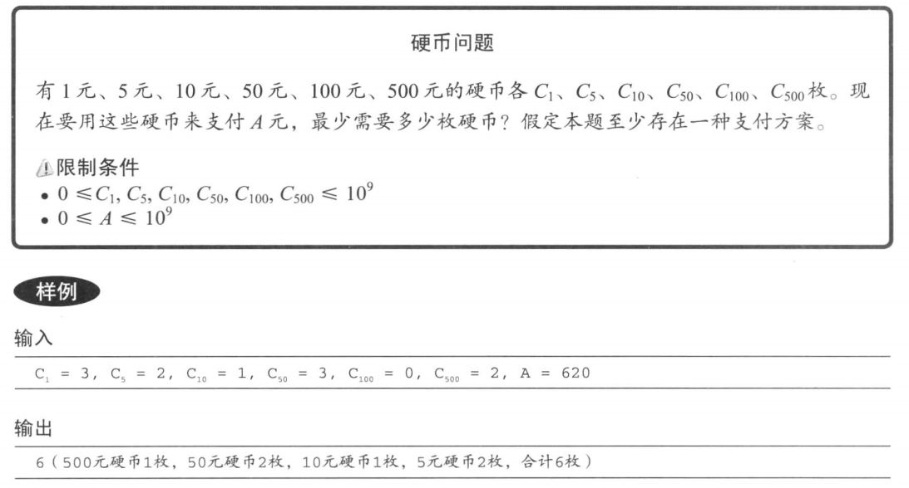

■优先使用面值大的硬币。


### 2.2.2 区间问题

区间调度问题

有n项工作，每项工作分别在 s<sub>i</sub>时间开始，在 t<sub>i</sub>时间结束。对于每项工作，你都可以选择参与与否。如果选择了参与，那么自始至终都必须全程参与。此外，参与工作的时间段不能重叠（即使是开始的瞬间和结束的瞬间的重叠也是不允许的 ）。

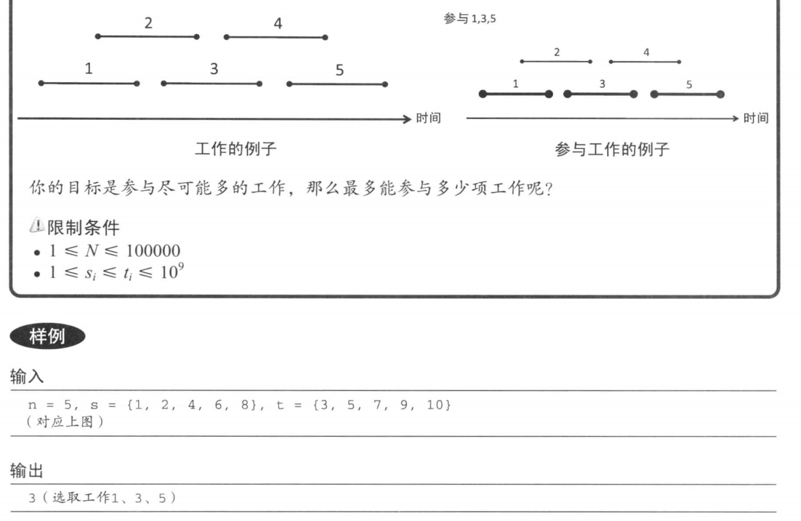

在可选的工作（也就是和目前已选的工作都不重叠的工作）中，每次都选取开始时间最早的工作。

该算法有一些不能正确处理的情况，例如对于下面的情况，该算法就无法得到正确的结果。

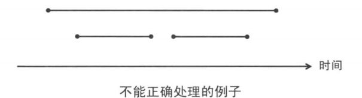

因此，如果我们不慎重地选择一个正确的规则，就会得到错误的算法。另外，我们还能够想到下列几种算法。

1. 在可选的工作中，每次都选取结束时间最早的工作。
2. 在可选的工作中，每次都选取用时最短的工作。
3. 在可选的工作中，每次都选取与最少可选工作有重叠的工作。

算法一是正确的，而其余两种都可以找到对应的反例。或者说，在有些情况下，它们所选取的工作并非最优。

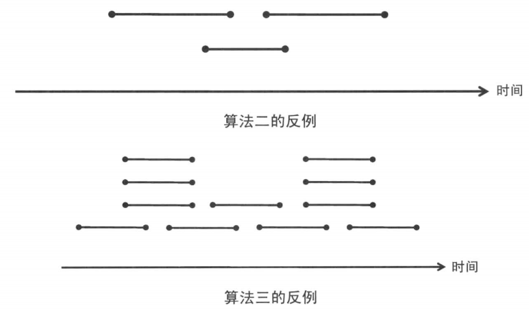


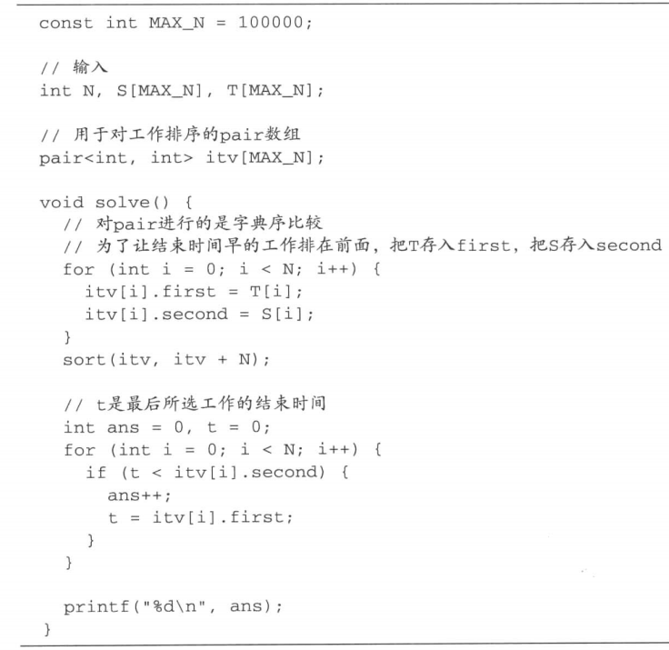

**贪心算法的证明**

结束时间越早之后可选的工作也就越多。这是该算法能够正确处理问题的一个直观解释。但是，这不能算是严格意义上的证明。我们可以按下面的方法来证明。

1. 与其他选择方案相比，该算法的选择方案在选取了相同数量的更早开始的工作时，其最终结束时间不会比其他方案的更晚。所以，不存在选取更多工作的选择方案。
   

(1)使用归纳法，（2)使用反证法，就可以完成严格意义上的证明（证明过程较长，在此不再赘述 ）。
在程序设计竞赛中，只要程序能够正确运行就好了，严格意义上的算法证明并不是必须的。因此可以说，有足够自信的话是不需要证明的。但是，如果不能坚信算法是正确的，当程序不能正确运行时，就会搞不明白到底是算法设计有问题还是程序实现有问题。有时候在头脑中简单地思考一下证明也是挺好的。

### 2.2.3 字典序最小问题

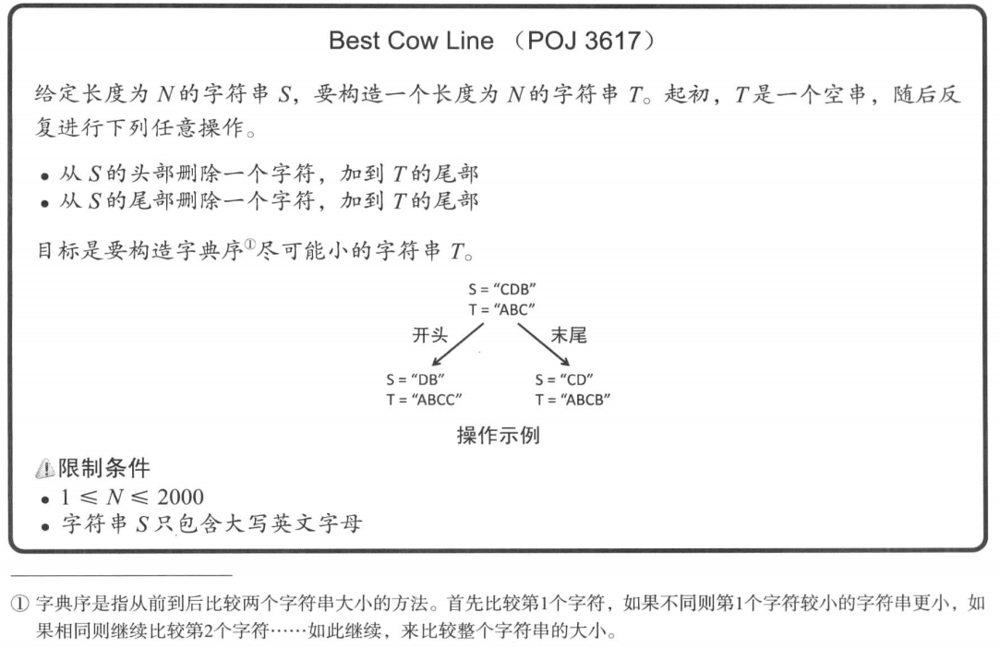

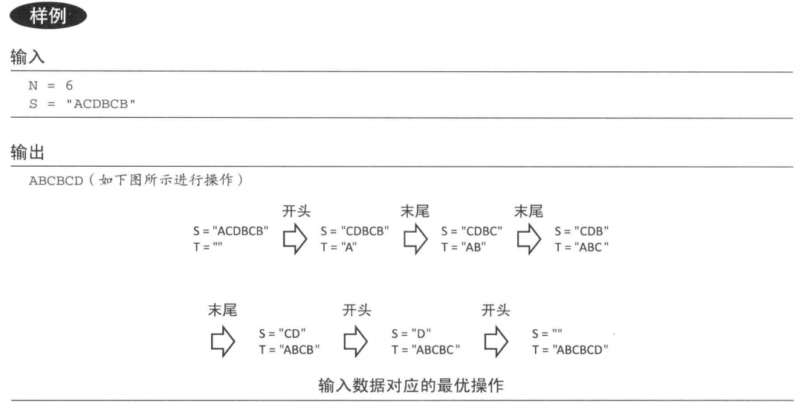


**Best Cow Line**

FJ is about to take his *N* (1 ≤ *N* ≤ 2,000) cows to the annual"Farmer of the Year" competition. In this contest every farmer arranges his cows in a line and herds them past the judges.

The contest organizers adopted a new registration scheme this year: simply register the initial letter of every cow in the order they will appear (i.e., If FJ takes Bessie, Sylvia, and Dora in that order he just registers BSD). After the registration phase ends, every group is judged in increasing lexicographic order according to the string of the initials of the cows' names.

FJ is very busy this year and has to hurry back to his farm, so he wants to be judged as early as possible. He decides to rearrange his cows, who have already lined up, before registering them.

FJ marks a location for a new line of the competing cows. He then proceeds to marshal the cows from the old line to the new one by repeatedly sending either the first or last cow in the (remainder of the) original line to the end of the new line. When he's finished, FJ takes his cows for registration in this new order.

Given the initial order of his cows, determine the least lexicographic string of initials he can make this way.


Input

\* Line 1: A single integer: *N*
\* Lines 2..*N*+1: Line *i*+1 contains a single initial ('A'..'Z') of the cow in the *i*th position in the original line

Output

The least lexicographic string he can make. Every line (except perhaps the last one) contains the initials of 80 cows ('A'..'Z') in the new line.

Sample Input

```
6
A
C
D
B
C
B
```

Sample Output

```
ABCBCD
```

我们很容易想到从头和尾分别比较这个字符的大小进行输出，总体的贪心思想正确，但是有个问题，就是在头尾两个字母相同时，我们要比较下一个字符，下一个字符再相同时又要比较下一个。

此时我们就可以找一个ss，来代表反转后的字符串s。如果s小从s开头取，ss小从s尾部取。剩下的就很简单了

```c++
#include <iostream>
#include<cstring>
#define MAX_N 2000
using namespace std;
int N;
char S[MAX_N+1];

int main()
{   cin>>N;
    memset(S,0,sizeof(S));
    for(int i=0;i<N;i++)
        cin>>S[i];
    //剩余的字符串为S[a],S[a+1],...,S[b]
    int a=0,b=N-1,j=1;
    while(a<=b){
        //将从左起和从右起的字符串进行比较
        bool left =false;
        for(int i=0;a+i<=b;i++){
            if(S[a+i]<S[b-i]){
                left=true;
                break;
            }
            else if(S[a+i]>S[b-i]){
                left=false;
                break;
            }
        }
        
        if(left) putchar(S[a++]);
        else putchar(S[b--]);
        if(j++%80==0)
            putchar('\n');
    }
    putchar('\n');
}
```

针对输出，每输出80个字符要换行一次

RuntimeError常见出错的原因可能有以下几种：

1、数组开得太小了，导致访问到了不该访问的内存区域

2、发生除零错误

3、大数组定义在函数内,导致程序栈区耗尽

4、指针用错了，导致访问到不该访问的内存区域

5、还有可能是程序抛出了未接收的异常

### 2.2.4 其他例题

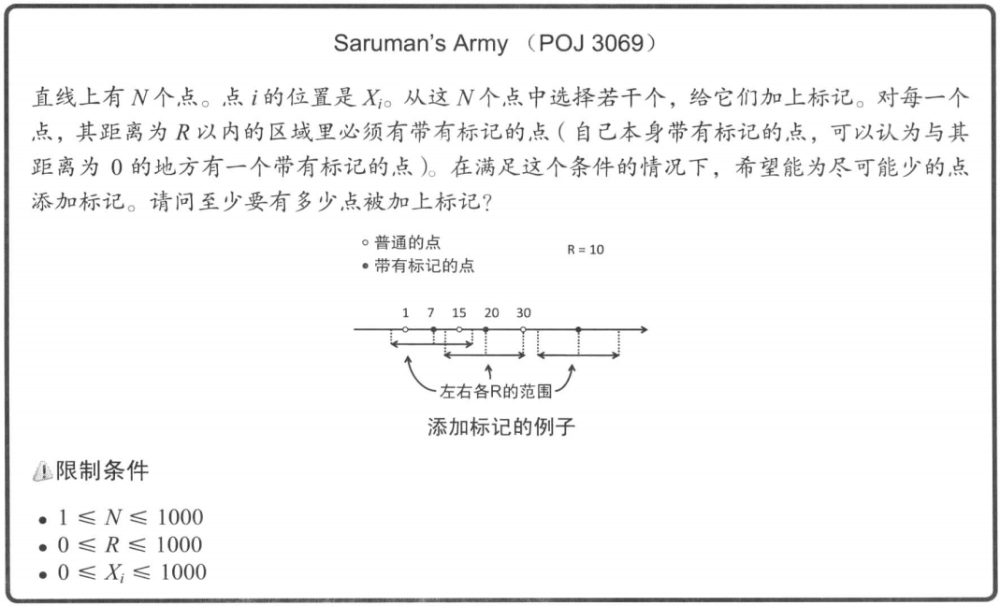


Sample Input

```
0 3
10 20 20
10 7
70 30 1 7 15 20 50
-1 -1
```

Sample Output

```
2
4
```

我们从最左边开始考虑。对于这个点，到距其 R以内的区域内必须要有带有标记的点。（此点位于最左边，所以显然）带有标记的这个点一定在此点右侧（包含这个点自身 )。于是，究竟要给哪个点加上标记呢？答案应该是从最左边的点开始，距离为R以内的最远的点。因为更左的区域没有覆盖的意义，所以应该尽可能覆盖更靠右的点。

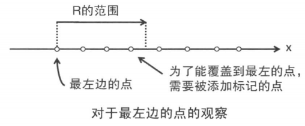

如上所示，加上了第一个标记后，剩下的部分也用同样的办法处理。对于添加了符号的点右侧相距超过 的下一个点，采用同样的方法找到其右侧及距离以内最远的点添加标记。在所有的点都被覆盖之前不断地重复这一过程。

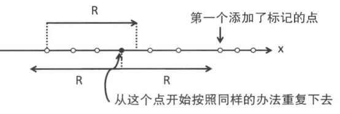

```c++
#include <iostream>
#include<algorithm>
#include<cstring>
#define MAX_N 1000
int N,R;
int X[MAX_N];
using namespace std;
int main(){
    while(cin>>R>>N&&R!=-1){
        memset(X,0,sizeof(X));
        for(int i=0;i<N;i++)
            cin>>X[i];
        sort(X,X+N);
        int i=0,ans=0;
        while(i<N){
            //s是没有被覆盖的最左的点的位置
            int s=X[i++];
            // 一直向右前进直到距s的距 离大于R的点
            while (i < N && X[i] <= s + R) i++;
            // p是新加上标记的点的位置
            int p = X[i - 1];
            // 一直向右前进直到距p的距 离大于R的点
            while (i < N && X[i] <= p + R) i++;
            ans++;
        }
    printf("%d\n", ans);
    }
	return 0;
}

```

### 2.Fence Repair

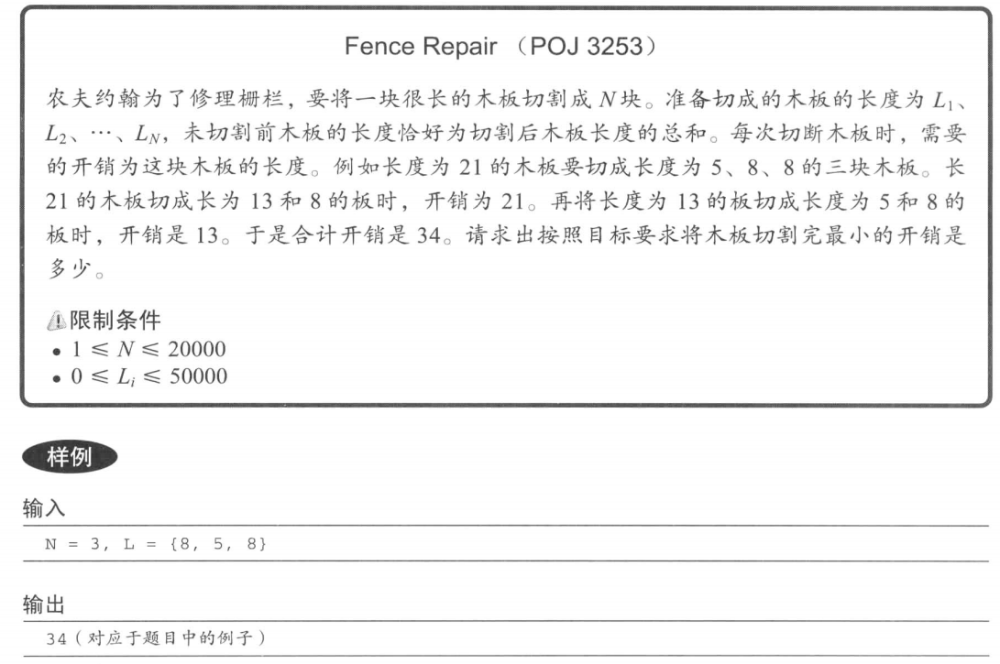

Sample Input

```
3
8
5
8
```

Sample Output

```
34
```

由于木板的切割顺序不确定，自由度很高，这个题目貌似很难人手。但是其实可以用略微奇特的贪心法来求解。
首先，切割的方法可以参见下图的二叉树来描述。

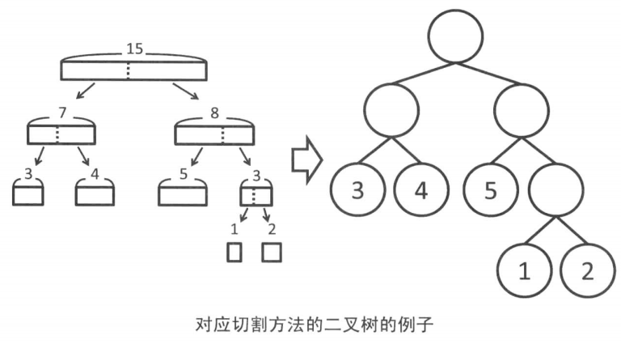

这里每一个叶子节点就对应了切割出的一块块木板。叶子节点的深度就对应了为了得到对应木板所需的切割次数，开销的合计就是各叶子节点的**木板的长度 x 节点的深度**的总和。

例如，上图示例的全部开销就可以这样计算:3 x 2+4 x 2+5 x 2+1 x 3+2 x 3=33
于是，此时的最佳切割方法首先应该具有如下性质:

**最短的板与次短的板的节点应当是兄弟节点**

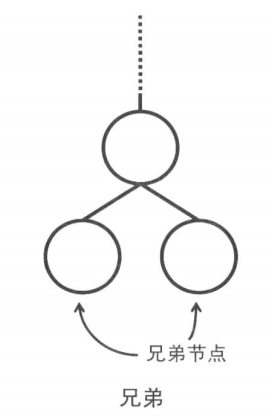

对于最优解来讲，最短的板应当是深度最大的叶子节点之一。所以与这个叶子节点同一深度的兄弟节点一定存在，并且由于同样是最深的叶子节点，所以应该对应于次短的板。

不妨将A按照大小顺序排列，那么最短的板应该是L1,而次短的则是L2。如果它们在二叉树中是兄弟节点，就意味着它们是从一块长度为(L1+L2)的板切割得来的。由于切割顺序是自由的，不妨当作是最后被切割。这样一来，在这次切割前就有 (L1+L2),L3,L4, ...,LN这样的N-1块木板存在

与以上讨论的方式相同，递归地将这N-1块木板的问题求解，就可以求出整个问题的答案。这样实现的话，虽然复杂度是O(N^2^), 对于题目的输入规模来说，已经足以在时间限制内通过了。

```c++
#include<iostream>
#define MAX_N 20000


typedef long long ll;
int N,L[MAX_N];
using namespace std;
int main(){
    cin>>N;
    for(int i=0;i<N;i++)
        cin>>L[i];
    ll ans=0;
    //直到计算到木板为1块时为止
    while(N>1){
	//求出最短的板子L1和次短L2
        int l1=0,l2=1;
        if(L[l1]>L[l2]) swap(l1,l2);
        for(int i=2;i<N;i++){
			if(L[i]<L[l1]){
				l2=l1;
                l1=i;
            }else if(L[i]<L[l2]){
                l2=i;
            }
        }
        //将两块板拼合
        int t=L[l1]+L[l2];
        ans+=t;
        if(l1==N-1) swap(l1,l2);
        L[l1]=t;//最短板子l1现在变成长度t的合成版
        L[l2]=L[N-1];//次短板子应该消失了，就变成最后一块板子，N--，相当于丢掉最后一块板子
        N--;
    }
    cout<<ans<<endl;
}

```

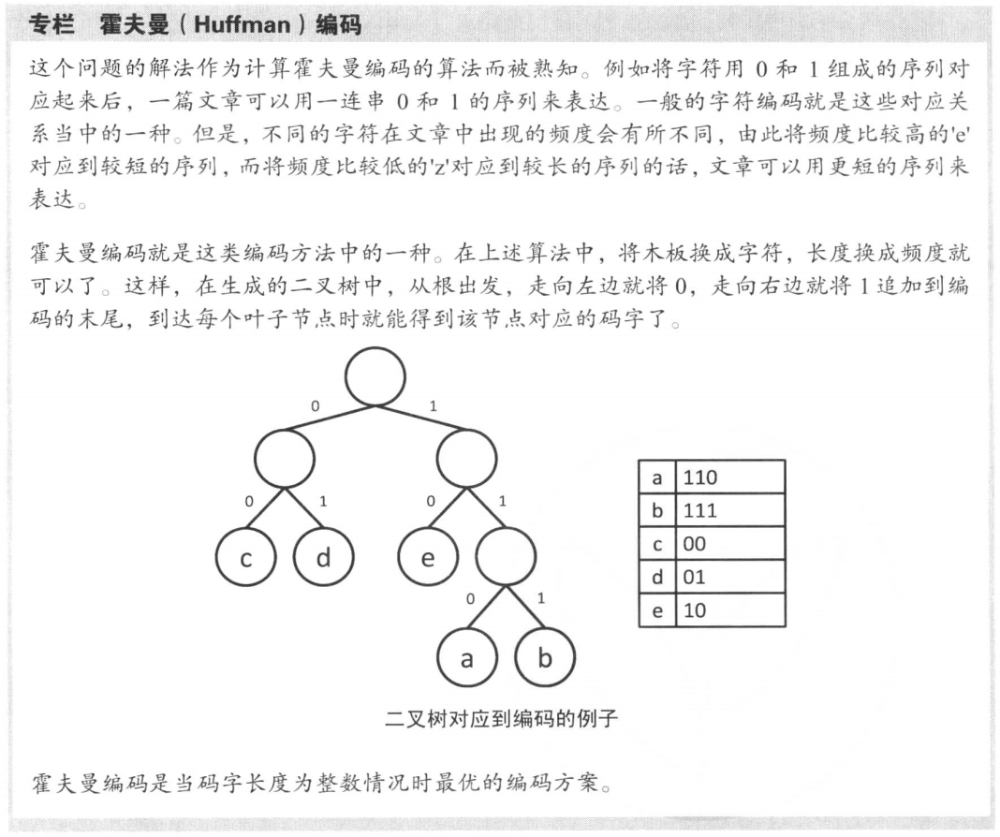


