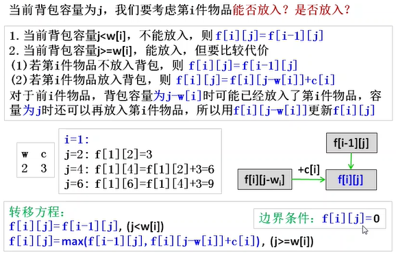

## 2.3 记录结果再利用的“动态规划”

### 2.3.1 记忆化搜索与动态规划

01 背包问题

有n个重量和价值分别为 Wi,Vi,的物品。从这些物品中挑选出总重量不超过 W的物品，求所有挑选方案中价值总和的最大值。

要知道复习的必要性还是非常有用的！！

最朴素的方法，针对每个物品是否放入背包进行搜索试试看

```c++
// 输入
int n,W;
int w[MAX_N], v[MAX_N];
// 从第i个物品开始挑选总重小于j的部分
int rec(int i,int j){
	int res;
    if(i==n){
		//已经没有剩余物品了
        res=0;
    }else if(j<w[i]){
		//无法挑选这个物品
        res=rec(i+1,j);
    }else{
        //挑选和不挑选的两种情况都尝试一下
        res=max(rec(i+1,j),rec(i+1,j-w[i])+v[i]);
        
    }
    return res;
}
void solve(){
    printf("%d\n",rec(0,W));
}
```

只不过，这种方法的搜索深度是n，而且每一层的搜索都需要两次分支，最坏就需要0(2^n^)的时间，当n比较大时就没办法解了。所以要怎么办才好呢？为了优化之前的算法，我们看一下针对样例输人的情形下rec递归调用的情况。


如图所示，rec以(3,2)为参数调用了两次。如果参数相同，返回的结果也应该相同，于是第二次调用时已经知道了结果却白白浪费了计算时间。让我们在这里把第一次计算时的结果记录下来，省略掉第二次以后的重复计算试试看。

```c++
int dp[MAX_N + 1][MAX_W + 1]; // 记忆化数组
int rec(int i,int j){
    if (dp[i][j] >= 0) {
	// 已经计算过的话直接使用之前的结果
        return dp[i][j];
    }
	...
    // 将结果记录在数组中
	return dp[i][j] =res;

}
void solve(){
	 memset(dp,-1,sizeof(dp));
    // 用-1表示尚未计算过，初始化整个数组
     printf("%d\n",rec(0,W));
}


```


专栏**使用memset进行初始化**
虽然 memset 按照 1 字节为单位对内存进行填充，-1 的每一位二进制位都是 1, 所以可以像0—样用 memset 进行初始化 通过使用 memset 可以快速地对高维数组等进行初始化，但是需要注意无法初始化成 1 之类的数值，


这微小的改进能降低多少复杂度呢？对于同样的参数，只会在第一次被调用到时执行递归部分，第二次之后都会直接返回。参数的组合不过 nW种,而函数内只调用2次递归，所以只需要的O(nW)复杂度就能解决这个问题。只需略微改良，可解的问题的规模就可以大幅提高。这种方法一般被称为记忆化搜索。


接下来，我们来仔细研究一下前面的算法利用到的这个记忆化数组。记`dp[i][j]`为根据rec的定义，从第i个物品开始挑选总重小于j时，总价值的最大值。于是我们有如下递推式


如上所示，不用写递归函数，直接利用递推式将各项的值计算出来，简单地用二重循环也苛以解决这一问题。


```c++
int dp[MAX_N+1][MAX_W+1]; //dp数组
void solve(){
    for(int i=n-1;i>=0;i--){
		for(int j=0;j<=W;j++){
            if(j<w[i]){
                dp[i][j]=dp[i+1][j];
            }else {
                dp[i][j]=max(dp[i+1][j],dp[i+1][j-w[i]]+v[i]);
            }
        }
    }
    printf("%d\n",dp[0][W]);
}
```

这个算法的复杂度与前面相同，也是〇(nW) ,但是简洁了很多。以这种方式一步步按顺序求出问题的解的方法被称作动态规划法，也就是常说的DP.解决问题时既可以按照如上方法从记忆化搜索出发推导出递推式，熟练后也可以直接得出递推式。

**注意不要忘记初始化**
因为全局数组的内容会被初始化为 0, 所以前面的源代码中并没有显式地将初项=0 进行赋值，不过当一次运行要处理多组输入数据时，必须要进行初始化，这点一定要注意。


刚刚讲到 DP 中关于 i 的循环是逆向进行的。反之，如果按照如下的方式定义递推关系的话，关于 i的循环就能正向进行。


```c++
void solve(){
    for(int i=0;i<n;i++){
		for(int j=0;j<=W;j++){
            if(j<w[i]){
                dp[i+1][j]=dp[i][j];
            }else {
                dp[i+1][j]=max(dp[i][j],dp[i][j-w[i]]+v[i]);
            }
        }
    }
    printf("%d\n",dp[0][W]);
}
```

此外，除了运用递推方式逐项求解之外，还可以把状态转移想象成从“前i个物品中选取总重不超过j时的状态”向“前i+1个物品中选取总重不超过j’和“前i+1个物品中选取总重不超过j+w[i]时的状态”的转移，于是可以实现成如下形式：


```c++
void solve(){
    for(int i=0;i<n;i++){
		for(int j=0;j<=W;j++){
            dp[i+1][j]=max(dp[i+1][j],dp[i][j]);
            if(j+w[i]<=W){
                dp[i+1][j+w[i]]=max(dp[i+1][j+w[i]],dp[i][j]+v[i]);
            }       
        }
    }
    printf("%d\n",dp[n][W]);
}
```

如果像上述所示，把问题写成从当前状态迁移成下一状态的形式的话，需要注意初项之外也需要初始化（这个问题中，因为价值的总和至少是0, 所以初值设为0就可以了，不过根据问题也有可能需要初始化成无穷大 ）。 同一个问题可能会有各种各样的解决方法，诸如搜索的记忆化或者利用递推关系的DP, 再或者从状态转移考虑的DP等，不妨先把自己最喜欢的形式掌握熟练。但是，有些问题不用记忆化搜索也许很难求解，反之，不用DP复杂度就会变大的情况也会有，所以最好要掌握**各种形式的DP**.

有些被绕进去了。

### 2.3.2 进一步探讨递推关系

**完全背包问题**

有n种重量和价值分别为 Wi,Vi,.的物品。从这些物品中挑选总重量不超过W的物品，求出挑选物品价值总和的最大值。在这里，每种物品可以挑选任意多件。


同一种类的物品可以选择任意多件了。我们再试着写出递推关系。


书中推导的进度实在是太快了，必须自己多加思考才行，单独看书是不足以支撑的


确定**状态变量**：`f[i][j]`表示前i件物品放入容量为j的背包中的最大价值



```C++
for(i=1;i<=n;i++)// item
    for(j=1;j<=m;j++) //capacity
        if(j<w[i])
            f[i][j]=f[i-1][j];
		else
            f[i][j]=max(f[i-1][j],f[i][j-w[i]]+c[i]);
//时间空间复杂度O(n*m)

//进行改进，用一维数组f[j]只记录一行数据，让j值顺序循环，顺序更新f[j]。空间复杂度降低

for(i=1;i<=n;i++)
    for(j=1;j<=m;j++)
        if(j<w[i])
            f[j]=f[j];
		else
            f[j]=max(f[j],f[j-w[i]]+c[i])
            
//因为j是顺序循环，f[j-w[i]]会先于f[j]更新，也就是说，用新值f[j-w[i]]去更新f[j],相当于用第i行的f[j-w[i]]去更新f[j],这就是滚动数组，空间复杂度降低
            
//进一步简化 
for(i=1;i<=n;i++)
    for(j=w[i];j<=m;j++)
		 f[j]=max(f[j],f[j-w[i]]+c[i])            
```


**多重部分和问题**

有 n 种不同大小的数字 ai, 每种各 mi个。判断是否可以从这些数字之中选出若干使它们的和恰好为 K

限制条件 1<=n<=100,1<=ai,mi<=100000,1<=K<=100000.


至于动态规划，最重要的就是准确定义动态数组的意义并找准前后的递推式.我们这里定义`dp[i][j]`为bool类型，其意义表示为用前i种数(下标为0~i-1)能否凑成和j,能的话则`dp[i][j]=true,反之则dp[i][j]=false`,那么根据其前一种状态dp`[i-1][j-k*a[i-1]](0<=k<=m[i-1]),如果dp[i-1][j-k*a[i-1]]＝true`,那么对于第i个数a[i-1]我们只要再用k个,那么就可以用前i个数凑成和为j。这是很容易理解的。递推关系式为：

`dp[i+1][j]=(0<=k<=mi且k*ai<=j时存在使得dp[i][j-k*ai]为真的k)`

```c++
#include<iostream>
using namespace std;
#define Max_N 100
#define Max_K 100000
bool dp[Max_N+1][Max_K+1];
int a[Max_N];
int m[Max_N];
int n,K;
 
void solve()
{
	dp[0][0]=true;
	for(int j=1;j<=K;j++)
	  dp[0][j]=false;          //用前0种数凑成和不为0的，肯定不行
	  
  //dp[i][j] 用前i种数(下标0~i-1)能不能凑成和为j 
	for(int i=1;i<=n;i++)
	{
		for(int j=0;j<=K;j++)
		{
			//下标为i-1的数使用k次 
			for(int k=0;k<=m[i-1] && k*a[i-1]<=j;k++)
			{
				//不断或等 
				dp[i][j] |= dp[i-1][j-k*a[i-1]];
			}
		}
	} 
	if(dp[n][K]) cout<<"Yes\n";
	else cout<<"No\n";
	return ;
}
int main()
{
	cin>>n>>K;
	for(int i=0;i<n;i++)
	{
		cin>>a[i];
	}
	
	for(int i=0;i<n;i++)
	{
		cin>>m[i];
	}
	solve();
}
```


其实大家也能看到这个程序的缺点就在于三重循环下，效率还是比较低，那么我们就想着有没有更高效的方法，那么我们就可以使用另一种定义方法dp[i] [j]表示：用前i种数(下标0~i-1)在能凑成和为j时，第i个数(下标为i-1)最多可以剩余多少个，-1表示前i种数凑不成和为j，递推关系式如下（每段的意义我将会写在程序的注释中）：

```c
//dp[i+1][j]:用前i种数加和得到j时第i种数最多能剩余多少个

dp[i+1][j]=mi  (dp[i][j]>=0)

　　　　　　-1  (j<ai||dp[i+1][j-ai]<=0)

　　　　　　dp[i+1][j-ai]-1  (其他)
```

```c++
#include<iostream>
using namespace std;
#define Max_N 100
#define Max_K 100000
int dp[Max_N+1][Max_K+1];
int a[Max_N];
int m[Max_N];
int n,K;
 
void solve()
{
	dp[0][0]=0;
	for(int j=1;j<=K;j++)
	  dp[0][j]=-1;          //用前0种数凑成和不为0的，肯定不行
	  
  //dp[i][j] 用前i种数(下标0~i-1)在能凑成和为j时，第i个数(下标为i-1)最多可以剩余多少个，-1表示前i种数凑不成和为j 
	for(int i=1;i<=n;i++)
	{
		for(int j=0;j<=K;j++)
		{
			if(dp[i-1][j]>=0)     
			//如果前i-1种数就能凑成和为j,那么第i个数a[i-1]可以一个都不用，全部剩下来
			    dp[i][j]=m[i-1];
			else             //前i-1种数凑不成和为j,那么就用第i个数a[i-1]尝试凑
			{
	//如果要凑的和j小于a[i-1],那么肯定凑不成j   ------   j<a[i-1]
	//无法用前i个数凑不成和j-a[i-1],那么无论再加不加上一个数a[i-1],都凑不成和j  -----dp[i][j-a[i-1]<0
	//如果在用前i个数能凑成和j-a[i-1],但是这时候a[i-1]数用完了，那么也是凑不成的 ------dp[i][j-a[i-1]=0
				if(j<a[i-1] || dp[i][j-a[i-1]]<=0)
				 dp[i][j]=-1;
				else
	//在前i种数能凑成和j-a[i-1]并且数a[i-1]还有剩余，那么是能凑成的,再用掉一个a[i-1]，所以个数减一 
				 dp[i][j]=dp[i][j-a[i-1]]-1; 
			} 
			//cout<<"dp["<<i<<"]["<<j<<"]:"<<dp[i][j]<<endl;   //测试使用 
		}
	} 
	//dp[n][K]>=0表明前n个数(a[0]~a[n-1])在凑成和为K时,数a[i-1]不剩余或者还有剩余，
	//但是不管剩余还是不剩余，都是能凑成和为j 
	if(dp[n][K]>=0) cout<<"Yes\n";
	else cout<<"No\n";
	
	return ;
}
int main()
{
	cin>>n>>K;
	for(int i=0;i<n;i++)
	{
		cin>>a[i];
	}
	
	for(int i=0;i<n;i++)
	{
		cin>>m[i];
	}
	solve();
}
```


**划分数**

```
问题描述：有n个无区别的物品，将它们划分成不超过m组，求出划分方法数 
```

**把n个同样的苹果放在m个同样的盘子里，允许有的盘子空着不放，问共有多少种不同的分法？（用K表示，5，1，1和1，5，1 是同一种分法）**

放苹果的问题乍看之下很复杂，盘子是一样的，苹果也是一样的；只要每个盘子里面放的苹果是一样多的，不管顺序如何最终得到的都是同一种分法。其实我们需要把问题简化。就拿这个放苹果的问题而言，我们只需要分两种情况：有空盘子和没空盘子。

1.有空盘子：f(n, m) = f(n, m-1) //有空盘子很多人会有疑问，这不是只有一个空盘子的情况吗？那2个3个空盘子呢？可以先思考一下

2.没有空盘子：f(n, m) = f(n-m, m) //没有空盘子，我们可以看成先给每一个盘子放一个苹果，则还剩下n-m个苹果，剩下的问题就是把这n-m个苹果放到m个盘子里的问题了。看到这里你是不是有点明白为什么第一种情况的递推是那样写的，其实本质是一样的，我们可以先看成先看成先让一个盘子空着，还有m-1个盘子，剩下的问题就是吧这n个苹果放到m-1个盘子里的问题。

因此：f(n, m) = f(n, m-1) + f(n-m, m)  ( n>=m) 

上面的表达式并不完整，当m<n时的情况没有考虑，当m<n的时候，f(n, m)就相当于f(n, n)

写到这里主要表达式基本上已经写完了，但是递推一般都要有边界，稍微看一下就能找到，当只有一个盘子时明显只有一种方法，另外没有苹果和只有一个苹果的时候也只有一种放法。即当m=1或者n=0时，f(n, m) = 1   

综上：

f(n, m) = 1 (m=1,n=0)

f(n, m) = f(n, n)  (n<m)

f(n, m) = f(n, m-1) + f(n-m, m)  ( n>=m) 


问题描述：有n个无区别的物品，将它们划分成不超过m组，求出划分方法数 

1.当 n=1，d为1，因为无论m为多少就只有1

2.当 m=1 时，d=1 ，由上例可知，当 n=4 时，d只有 1+1+1+1 这1种

3.当 n=m 时，又分为两种情况：

- 第一种就是包含m的时候，就只有 m 这一种。
- 另外一种就是不包含 m ，那么最大数就为 m-1 ,有 d(n,m-1) 种

4.因此当 n=m 时，d(n , n)=1+ d(n,n-1）

5.当n < m 就相当于 d(n,n) 了

6.当 n > m 时，一种是不含m，为d（n，m-1）种,一种是含有m，有d（n-m，m）种

因此d(n,m)=d（n-m，m）+d（n，m-1）

(*注意理解d（n-m，m），注意这里的前提是划分包含m，所以将m提出来一个，保证划分中一定会有m，剩下数字划分的和为n-m，而这n-m中可能不会出现m，也可能出现m，但由于我们已经提出了一个m，所以此处不用担心m是否再出现。*

*第一个数为什么是（n-m）,原因是提出一个m后，已经保证了划分中一定出现m，而n-m还没有进行划分，这里忽略提出的m，对剩下的整数n-m进行划分，划分的最大值仍然是m)*

 


那我们可以定义

**状态：dp[i] [j]表示 j 的 i 划分数 (注意，j的i划分表示的意义为 j固定，i可以取到1- i)**

**状态转移方程：1.j >= i时，dp[i] [j] = dp[i-1] [j] ( j的i-1划分，相当于当前位取0的全部情况 ) + dp[i] [j-i]（当前位不取0，先把每一个置为1，再将剩下的j-i分下去）**

　　　　　　　**2.j < i时，dp[i] [j] = dp[i-1] [j]; 当前位只能取0**

核心代码：

```c++
void solve()
{
    dp[0][0];
    for (int i = 0; i <= m; i++) {
        for (int j = 0; j <= n; j++) {
            if (j>=i)
                dp[i][j] = dp[i-1] + dp[i][j-1];
            else
                dp[i][j] = dp[i-1][j];    
        }
    }
    printf("%d\n", dp[m][n]);
}
```


**多重集组合数**

题目: 有n种物品, 第i种物品有ai个. 不同种类的物品可以互相区分, 但相同种类的无法区分.

从这些物品中取出m个, 有多少种取法? 求出方案数模M的余数.

例如: 有n=3种物品, 每种a={1,2,3}个, 取出m=3个, 取法result=6(0+0+3, 0+1+2, 0+2+1, 1+0+2, 1+1+1, 1+2+0).

dp [i] [j]  表示前i种物品,一共拿了j个物品的方法数

为了得到dp[i] [j]，那么可以从前i-1种物品取j-k个,再从第i种物品取k个即可

即 有： 

$$\begin{equation*}dp[i][j] = \sum\limits_{k=0}^{min(j,x[i])}dp[i-1][j-k]\end{equation*}$$

然而这个公式是O（n  （m^2））的。

不过我们可以发现，把右边求和式展开

分两种情况：


情况1：j<=x[i]  （即j-1<x[i]）

右边展开得到的是dp[i] [0] dp[i] [1] dp[i] [2]....dp[i] [j] 、 把最后一项拿出来，剩下的j-1项求和，但是我们

写成$$\sum\limits_{k=0}^{min(j-1,x[i])}dp[i-1][j-1-k]$$

，与原来等价，且我们能轻易发现，这就是dp[i] [j-1];

也就是 `dp[i][j]=dp[i][j-1]+dp[i-1`][j];

情况 2：  j>x[i]

右边展开得到的是`dp[i][j-x[i]] dp[i][j-x[i]+1] dp[i][j-x[i]+2]....dp[i][j]` 、仿照上面的形式，同样得到一个求和式（上界取x[i]），

$$\sum\limits_{k=0}^{min(j-1,x[i])}dp[i-1][j-1-k]$$

显然能发现这个式子拆开后，多出一项dp[i] [j-1-x[i]]，所以最后要减掉，即：`dp[i][j]=dp[i][j-1]+dp[i-1][j] - dp[i][j-1-x[i]]`;

综上，递推式为：

```c

if(j >a[i] )
dp[i+1][j] = (dp[i][j] + dp[i+1][j-1] - dp[i][j-1-a[i]] +M)%M;
else{
dp[i+1][j] = dp[i][j] + dp[i+1][j-1]; 
```

