## 0-1 Knapsack Problem（0-1背包问题）

输入
• 𝒏个商品组成集合𝑶，每个商品有两个属性𝒗𝒊和𝒑𝒊 ，分别表示体积和价格
• 背包容量为𝑪
输出
• 求解一个商品子集𝑺 ⊆ 𝑶，令

$$\begin{equation*}p = max\sum\limits_{i{\in}S}p_i\end{equation*}\rightarrow 优化目标$$

$$ s.t.\sum\limits_{i{\in}S}v_i{\le}C \rightarrow 约束条件$$


问题实例

超市赢家

* 超市允许顾客使用一个体积大小为13的背包，选择一件或多件商品带走，希望价值之和最大

  商品 价格 体积
  啤酒 24     10
  汽水 2        3
  饼干 9        4
  面包 10 	 5
  牛奶 9 	   4


蛮力枚举法：

先枚举所有商品的组合 （2^n^-1）(Cn^1^+Cn2+Cn3+Cn4+Cn5)(可能会超但先不管然后检查体积约束)

然后找价格最大的。


蛮力枚举：递归求解

递归函数：KnapsackSR (𝒉,𝒊, 𝒄)
⚫ 在第𝒉个到第𝒊个商品中，容量为𝒄时最优解

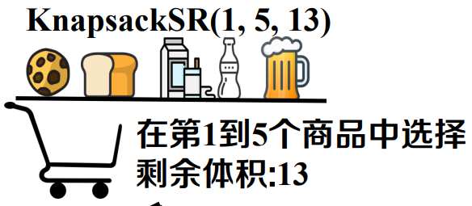

​										举例：KnapsackSR(1, 5, 13)

选择啤酒：KnapsackSR(1, 4, 3) + 24    不选啤酒：KnapsackSR(1, 4, 13)


KnapsackSR(𝒉,𝒊, 𝒄) =max{KnapsackSR(𝒉,𝒊 − 𝟏, 𝒄 − 𝒗𝒊) + 𝒑𝒊, KnapsackSR(𝒉,𝒊 − 𝟏, 𝒄)}


伪代码 KnapsackSR(𝒉,𝒊, 𝒄)：在第𝒉个到第𝒊个商品中，容量为𝒄时最优解

输入：商品集合{h，....,i} ，背包容量c

输出：最大总价格P

```c++
if c<0 then		//超出背包容量限制
    return -INF
end
if i<=h-1 then	//所有商品已决策完成
    return 0
end
p1=knapsackSR(h,i-1,c-vi)//选择商品i
p2=knapsackSR(h,i-1,c)	//不选i
p=max{p1+pi,p2}
return p
```

重复求解大量子问题 𝑶(𝟐^𝒏^)

优化将参数h去掉，然后还要优化,来一个备忘录（记忆化搜索，自顶向下再自底向上）

构造备忘录𝑷[𝒊, 𝒄].𝑷[𝒊, 𝒄]表示在前𝒊个商品中选择，背包容量为𝒄时的最优解

动态规划：不递归，直接自底向上求解


初始化
⚫ 容量为0时：𝑷 [𝒊, 𝟎] = 𝟎
⚫ 没有商品时：𝑷 [𝟎, 𝒄] = 𝟎

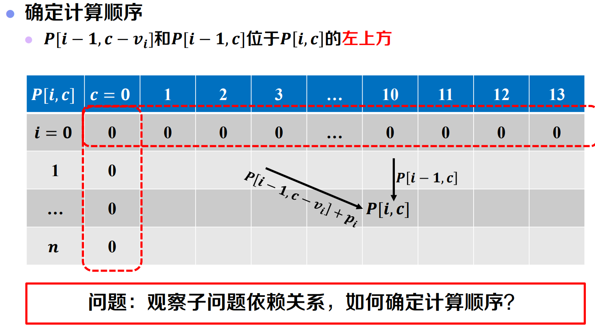

**按从左到右、从上到下的顺序计算**

递推公式：𝑷 [𝒊, 𝒄]= 𝐦𝐚𝐱{𝑷 [𝒊 − 𝟏, 𝒄 − 𝒗 [𝒊]] + 𝒑[𝒊], 𝑷[𝒊 − 𝟏, 𝒄]}

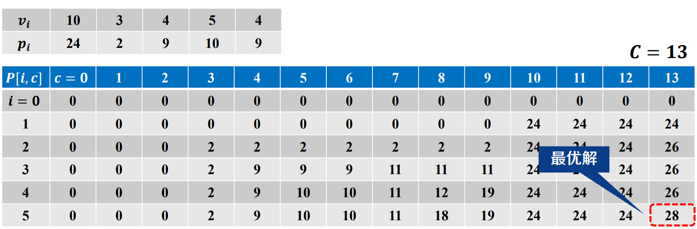

问题：如何确定选取了哪些商品？

**最优解追踪**

记录决策过程
𝑹𝒆𝒄[𝒊,𝒄] = 

𝟏, 选择商品

𝟎, 不选商品

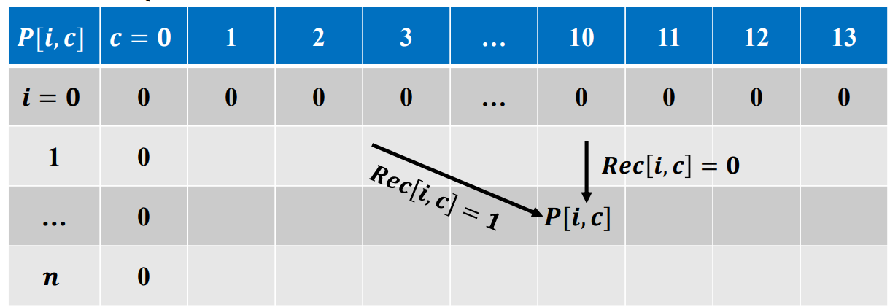

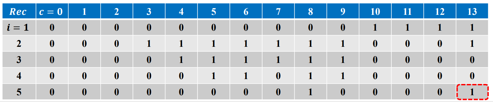

rec[5,13]=1最优解包含商品v5=4,跳到rec[4,9]=1,最优解包含商品v4=5,看rec[3,4]=1,最优解包含商品v3=4,看rec[2,0]=0，没得选。


KnapsackDP(𝒏, 𝒑, 𝒗, 𝑪) 

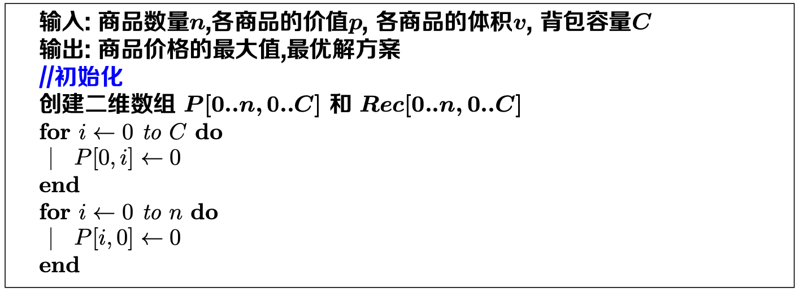

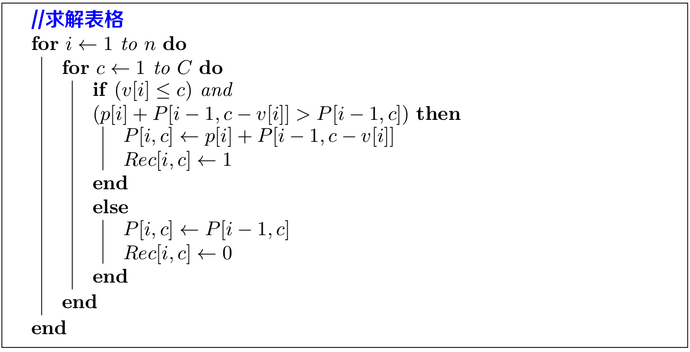


时间复杂度：𝑶(𝒏 ⋅ 𝑪)

0-1背包问题

带备忘递归 、递推求解都可以说是 动态规划


动态规划：一般步骤

1. 问题结构分析  给出问题表示，明确原始问题
2. 递推关系建立  分析最优结构，构造递推公式
3. 自底向上计算  确定计算顺序，依次求解问题
4. 最优方案追踪  记录决策过程，输出最优方案


* 分析最优（子）结构

最优子结构性质（Optimal Substructure）：问题的最优解由相关子问题最优解**组合而成**、子问题可以**独立求解**

* 构造递推公式
* 确定计算顺序
  * 初始化
  * 依次求解问题

* 记录决策过程
* 输出最优方案


## 最大子数组问题 Max Continuous Subarray, MCS

子数组为数组𝑿中**连续**的一段序列

问题：寻找数组𝑿最大的非空子数组?


形式化定义

输入
• 给定一个数组𝑿[𝟏. . 𝒏]，对于任意一对数组下标为𝒍, 𝒓 (𝒍 ≤ 𝒓)的非空子数组，其和记为

$$\begin{equation*}S(l,r) = \sum\limits_{i{\in}S}^rX[i]\end{equation*}$$

输出
• 求出𝑺(𝒍, 𝒓)的最大值，记为𝑺𝒎𝒂x


**蛮力枚举**

数组𝑿[𝟏. . 𝒏]，其所有的下标𝒍, 𝒓(𝒍 ≤ 𝒓)组合分为以下两种情况

* 当𝒍 = 𝒓时，一共𝑪𝒏^𝟏^ = 𝒏种组合
* 当𝒍 < 𝒓时，一共𝑪𝒏^𝟐^种组合

枚举𝒏 + 𝑪𝒏^𝟐^种下标𝒍, 𝒓组合，求出最大子数组之和

.........

算法名称 时间复杂度
蛮力枚举 𝑶(𝒏^𝟑^)
优化枚举 𝑶(𝒏^𝟐^)
分而治之 𝑶(𝒏𝐥𝐨𝐠 𝒏)
**动态规划** 𝑶(𝒏)

 

最大子数组规律描述

𝑫𝒊：以𝑿[𝒊]开头的最大子数组和

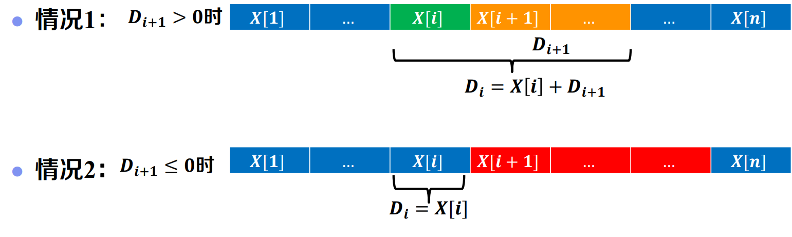

解题步骤：

**1. 问题结构分析**  

* 给出问题表示

* 𝑫[𝒊]: 以𝑿[𝒊]开头的最大子数组和

* 明确原始问题

$$\begin{equation*}S_{max} = \max\limits_{1\le i\le n}\{D[i]\}\end{equation*}$$

**2. 递推关系建立：分析最优（子）结构**

情况1：𝑫[𝒊 + 𝟏] > 𝟎 ,𝑫[𝒊] = 𝑿[𝒊]  + 𝑫[𝒊 + 𝟏]

情况2：𝑫[𝒊 + 𝟏] ≤ 𝟎, 𝑫[𝒊] = 𝑿[𝒊]

**3. 自底向上计算：确定计算顺序**

初始化

* 𝑫 𝒏 = 𝑿[𝒏]

* 递推公式

𝑫[𝒊] =
𝑿 [𝒊] + 𝑫 [𝒊 + 𝟏] , 𝒊𝒇 𝑫[𝒊 + 𝟏] > 𝟎
𝑿 [𝒊] , 𝒊𝒇 𝑫[𝒊 + 𝟏] ≤ 𝟎

从右向左

**4. 最优方案追踪：记录决策过程**

构造追踪数组𝑹𝒆𝒄 [𝟏. . 𝒏]

情况1：结尾相同

* 𝑹𝒆𝒄 [𝒊] = 𝑹𝒆𝒄[𝒊 + 𝟏]

情况2：结尾不同

* 𝑹𝒆𝒄 [𝒊] = 𝒊

从子问题中查找最优解

最大子数组开头位置：𝒊

最大子数组结尾位置：𝑹𝒆𝒄[𝒊]


**动态规划：伪代码**

Max-Continuous-Subarray-DP(𝑿, 𝒏)

时间复杂度：𝑶(𝒏)

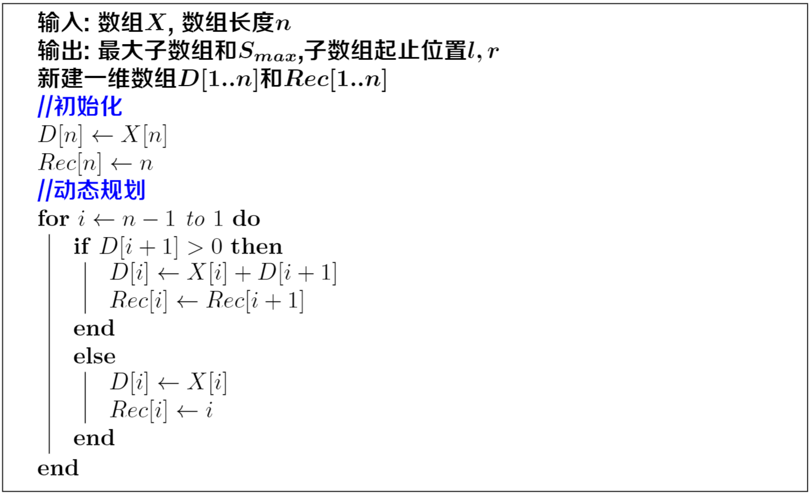

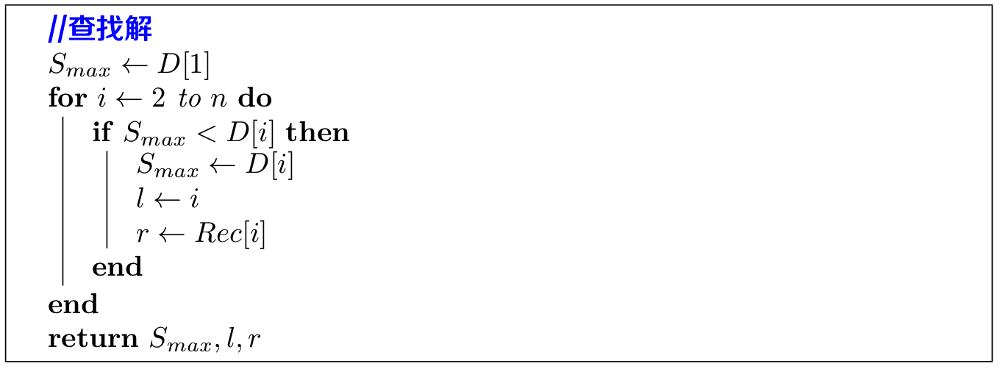


## 动态规划篇：最长公共子序列问题

子序列

* 将给定序列中零个或多个元素（如字符）去掉后所得结果

按序但不一定连续

**Longest Common Subsequence Problem**形式化定义

输入
• 序列𝑿 =< 𝒙𝟏, 𝒙𝟐, … , 𝒙𝒏 >和序列𝒀 =< 𝒚𝟏, 𝒚𝟐, … , 𝒚𝒎 >

输出
• 求解一个公共子序列𝒁 =< 𝒛𝟏, 𝒛𝟐, … , 𝒛𝒍 >，令

𝐦𝐚𝐱 |𝒁|           优化目标

𝒔. 𝒕. < 𝒛𝟏, 𝒛𝟐, … , 𝒛𝒍 > =< 𝒙𝒊𝟏, 𝒙𝒊𝟐, … , 𝒙𝒊𝒍 > =< 𝒚𝒋𝟏, 𝒚𝒋𝟐, … , 𝒚𝒋𝒍 >

(𝟏 ≤ 𝒊𝟏 < 𝒊𝟐, … ,𝒊𝒍 ≤ 𝒏; 𝟏 ≤ 𝒋𝟏 < 𝒋𝟐, … ,𝒋𝒍 ≤ 𝒎)         约束条件


蛮力枚举

枚举所有子序列  长度为1的、2的。。。。

解题步骤：

**1. 问题结构分析**  

* 给出问题表示

  𝑪[𝒊,𝒋]：𝑿[𝟏. .𝒊]和𝒀[𝟏. .𝒋]的最长公共子序列长度

* 明确原始问题

  𝑪[𝒏, 𝒎]： 𝑿[𝟏. . 𝒏]和𝒀[𝟏. . 𝒎]的最长公共子序列长度

**2. 递推关系建立：分析最优（子）结构**

考察末尾字符

情况1：不等 不同时出现

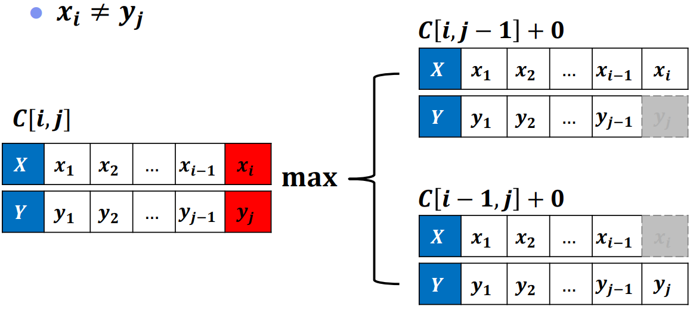

𝑪[𝒊,𝒋] = 𝐦𝐚𝐱 {𝑪[𝒊 − 𝟏,𝒋], 𝑪[𝒊,𝒋 − 𝟏]}

看出来具有最优子结构性质


情况2：相等 可同时出现 也可不同时出现

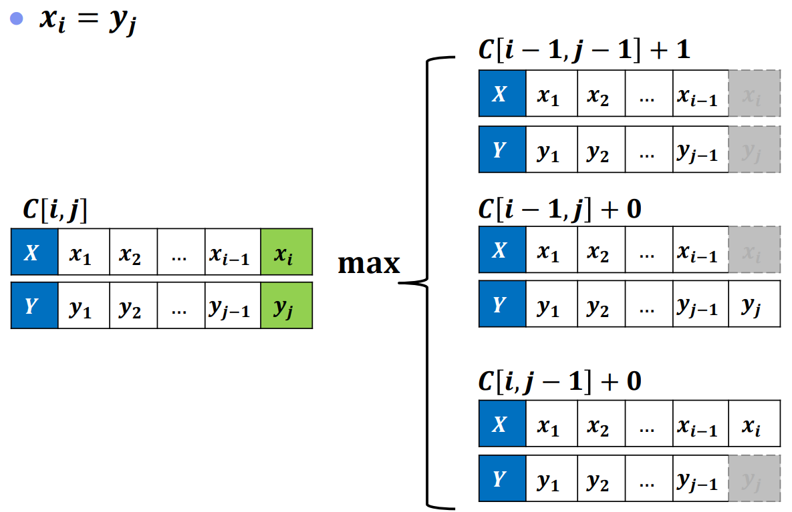

𝑪 [𝒊 − 𝟏,𝒋] 比𝑪 [𝒊 − 𝟏,𝒋 − 𝟏] 至多大𝟏

𝑪 [𝒊,𝒋 − 𝟏] 比𝑪[ 𝒊 − 𝟏,𝒋 − 𝟏] 至多大𝟏

𝑪 [𝒊 − 𝟏,𝒋 − 𝟏] + 𝟏，另外两个+𝟎

𝑪[𝒊 − 𝟏,𝒋 − 𝟏] + 𝟏≥ 𝐦𝐚𝐱{𝑪[𝒊,𝒋 − 𝟏], 𝑪[𝒊 − 𝟏,𝒋]}


情况简化：𝑪[𝒊,𝒋] = 𝑪[𝒊 − 𝟏,𝒋 − 𝟏] + 𝟏 （具有最优子结构）

**3. 自底向上计算：确定计算顺序**

初始化

* C [𝒊, 𝟎] = 𝑪[𝟎,𝒋] = 𝟎

  * 某序列长度为0时，最长公共子序列长度为0

  

递推公式

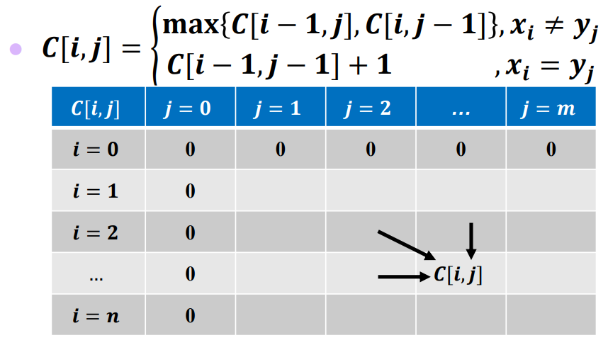


**4. 最优方案追踪：记录决策过程**

构造追踪数组𝒓𝒆𝒄 [𝟏. . 𝒏] ，记录子问题来源

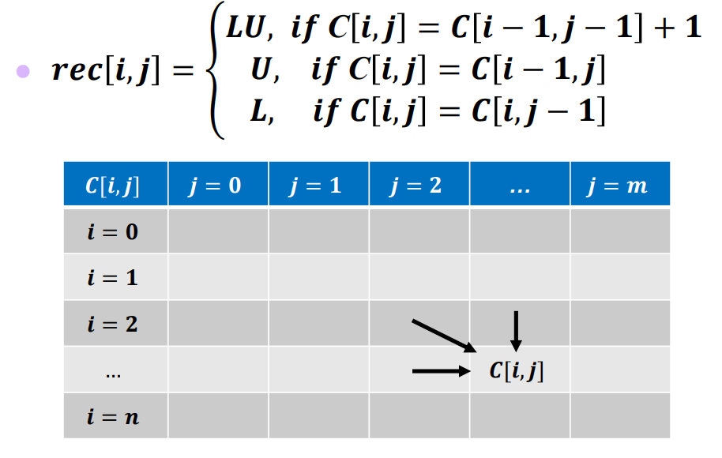

如果上左相等，默认从U来的

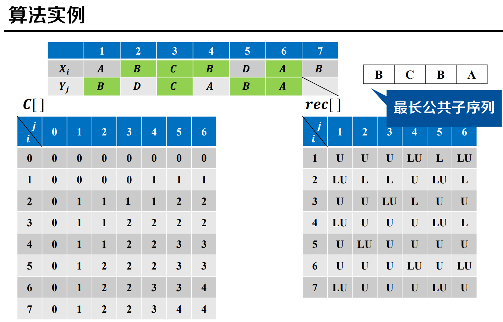

伪代码

Longest-Common-Subsequence(𝑿, 𝒀)

时间复杂度：𝑶(𝒏 ⋅ 𝒎)

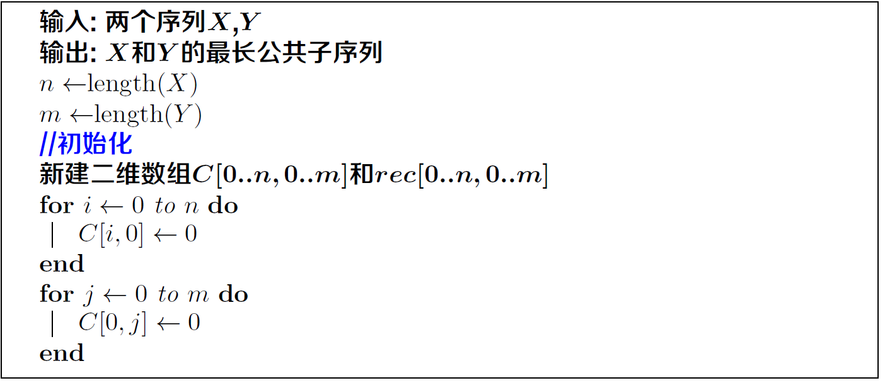

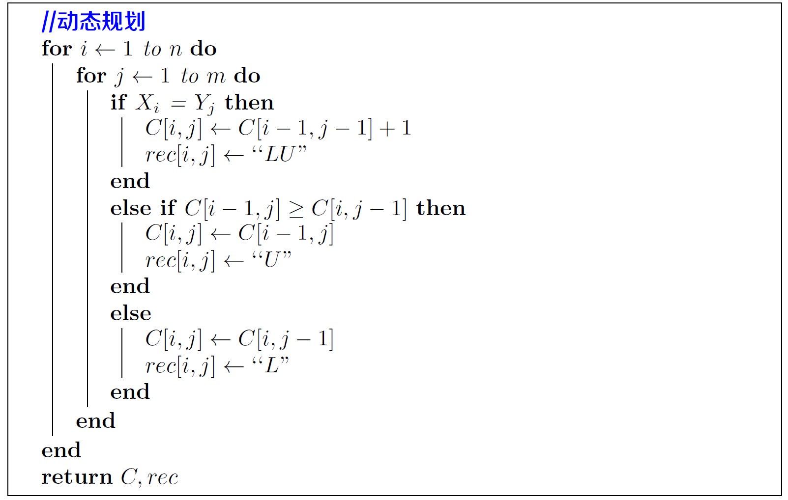

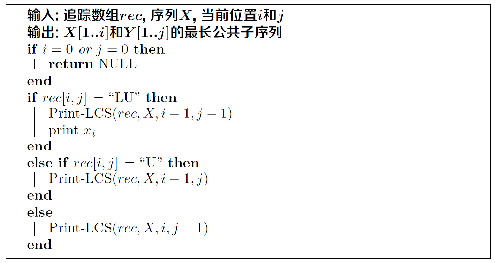


## 动态规划篇：最长公共子串问题

**子序列**: 将给定序列中零个或多个元素（如字符）去掉后所得结果
**子串**: 给定序列中零个或多个**连续**的元素（如字符）组成的子序列

子串一定是子序列

**Longest Common Substring Problem**

输入
• 序列𝑿 =< 𝒙𝟏, 𝒙𝟐, … , 𝒙𝒏 >和序列𝒀 =< 𝒚𝟏, 𝒚𝟐, … , 𝒚𝒎 >
输出
• 求解一个公共子串𝐙 =< 𝐳𝟏, 𝐳𝟐, … , 𝐳𝒍 > ，令

​				𝐦𝐚𝐱 |𝒁|         优化目标

𝒔. 𝒕. 𝒁 =< 𝒙𝒊, 𝒙𝒊+𝟏, … , 𝒙𝒊+𝒍−𝟏 > =< 𝒚𝒋, 𝒚𝒋+𝟏, … , 𝒚𝒋+𝒍−𝟏 >
(𝟏 ≤ 𝒊 ≤ 𝒏 − 𝒍 + 𝟏; 𝟏 ≤ 𝒋 ≤ 𝒎 − 𝒍 + 𝟏)       约束条件


**蛮力枚举得思路**

* 枚举所有的𝑿 [𝒊] , 𝒀 [𝒋]
* 求以其为结尾的尽可能长的公共子串
* 记录最长公共子串长度

序列𝑿和序列𝒀各选择一个位置

依次检查元素是否匹配

* 元素相等继续匹配

* 元素不等(或某序列已达端点)匹配终止


解题步骤：

**1. 问题结构分析**  

* 给出问题表示

𝑪 [𝒊,𝒋]
𝑿[𝟏. .𝒊]和𝒀[𝟏. .𝒋]中，**以𝒙𝒊和𝒚𝒋结尾**的最长公共子串𝒁[𝟏. .𝒍]的长度  𝒙𝒊=𝒛𝒍=𝒚𝒊

* 明确原始问题

$$\begin{equation*}P_{max} = \max\limits_{1\le i\le n,1\le j\le m}\{C[i,j]\}\end{equation*}$$

 𝑿[𝟏. . 𝒏]和𝒀[𝟏. . 𝒎]中最长公共子串的长度

**2. 递推关系建立：分析最优（子）结构**

情况𝟏：𝒙𝒊 ≠ 𝒚𝒋： 𝑪 𝒊,𝒋 = 𝟎

情况𝟐：𝒙𝒊 = 𝒚𝒋     𝑪[𝒊,𝒋] = 𝑪 [𝒊 − 𝟏,𝒋 − 𝟏] + 𝟏

**3. 自底向上计算：确定计算顺序**

初始化

* 𝑪[𝒊, 𝟎] = 𝑪[𝟎,𝒋] = 𝟎
  * 某序列长度为𝟎时，最长公共子串为𝟎

递推公式

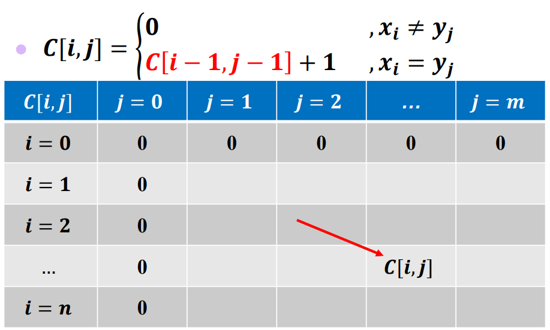


**4. 最优方案追踪：记录决策过程**

记录决策过程

* 最长公共子串末尾位置为𝒑𝒎𝒂𝒙
* 最长公共子串长度为𝒍𝒎𝒂𝒙

输出最优方案

* 最长公共子串< 𝒙𝒑𝒎𝒂𝒙−𝒍+𝟏, 𝒙𝒑𝒎𝒂𝒙−𝒍+𝟐, … , 𝒙𝒑𝒎𝒂𝒙>

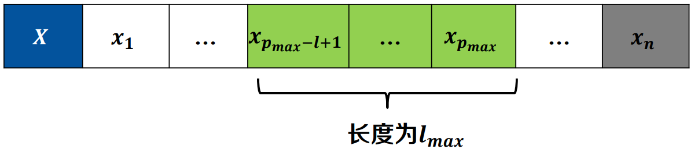


**算法实例**

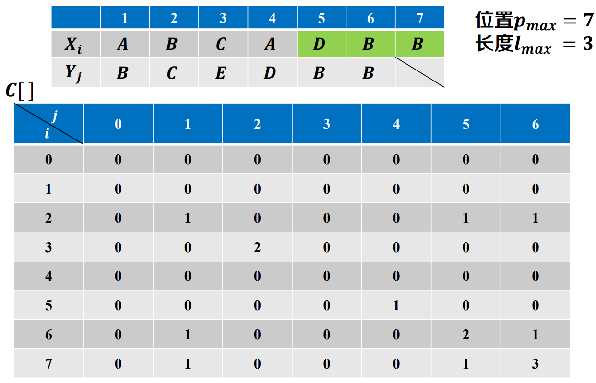


**伪代码**

Longest-Common-Substring(𝑿, 𝒀)


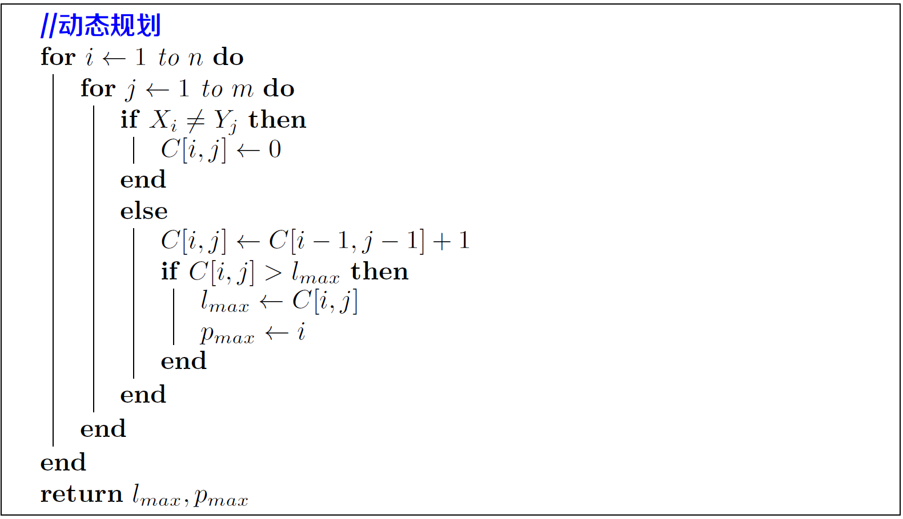

Print-LCS(𝑿, 𝒍𝒎𝒂𝒙, 𝒑𝒎𝒂𝒙)

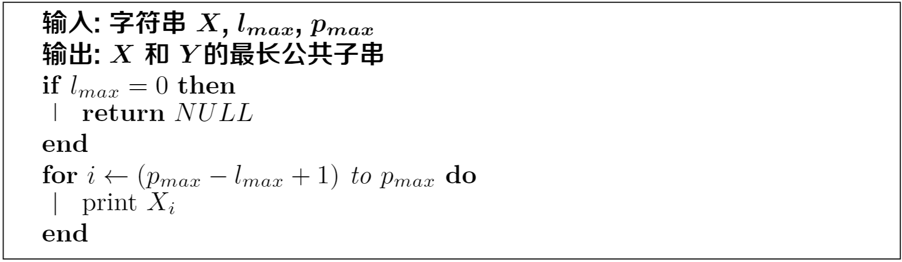

时间复杂度：𝑶(𝒏 ⋅ 𝒎)